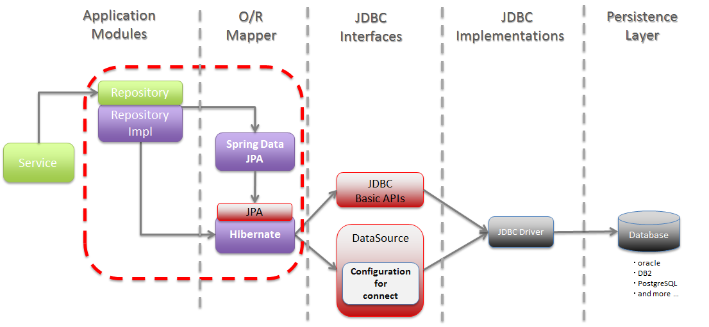

# Spring JPA


## JPA란?
 * Java Persistence API (자바 ORM 기술에 대한 API 표준 명세)
 * ORM을 사용하기 위한 인터페이스를 모아둔 것 이라고 볼 수 있다.
 * 자바 어플리케이션에서 관계형 데이터베이스를 사용하는 방식을 정의한 인터페이스이다.
 * ORM에 대한 자바 API 규격이며 Hibernate, OpenJPA 등이 JPA를 구현한 구현체 이다.
 * Hibernate 이외에도 EcipseLink, DataNucleus, OpenJPA, TopLink 등이 있다.
 
※결국 인터페이스이기 때문에 JPA를 사용하기 위해서는 JPA를 구현한 Hibernate, EclipseLink, DataNucleus 같은 ORM 프레임워크를 사용해야 한다.

## Hibernate?
 * JPA를 사용하기 위해서 JPA를 구현한 ORM 프레임워크중 하나.
   (자바를 위한 오픈소스 ORM(Object-relational mapping) 프레임워크를 제공한다.)
 * Hibernate는 JPA 명세의 구현체이다. javax.persistence.EntityManager와 같은 JPA의 인터페이스를 직접 구현한 라이브러리이다.

▶ 장점
 - 생산성이 뛰어나고 유지보수가 용이하다.(데이터베이스 중심 설계에서 객체 중심 설계로 변경됨에 따른)
 - 객체 지향적인 코드로 인해 더 직관적이고 비즈니스 로직에 더 집중할 수 있게 도와준다.
 - 객체지향적으로 데이터를 관리할 수 있기 때문에 전체 프로그램 구조를 일관되게 유지할 수 있다.
 - SQL을 직접적으로 작성하지 않고 객체를 사용하여 동작하기 때문에 유지보수가 더욱 간결하고, 재사용성도 증가하여 유지보수가 편리해진다.
 - DB컬럼이 추가될 때마다 테이블 수정이나 SQL 수정하는 과정이 많이 줄어들고, 값을 할당하거나, 변수 선언등의 부수적인 코드 또한 급격히 줄어든다.
 - 각각의 객체에 대한 코드를 별도로 작성하여 코드의 가독성도 올라간다.

## DAO(Data Access Object) 란?
repository package

* 실제로 DB에 접근하는 객체이다.  
  -> Persistence Layer(DB에 data를 CRUD하는 계층)이다.  
* Service와 DB를 연결하는 고리의 역할을 한다.  
* SQL를 사용(개발자가 직접 코딩)하여 DB에 접근한 후 적절한 CRUD API를 제공한다.  
  -> JPA 대부분의 기본적인 CRUD method를 제공하고 있다.  
```java
extends JpaRepository<User, Long>
```

* 예시(JPA 사용 시)  
```java
public interface QuestionRepository extends CrudRepository<Question, Long> { 
}
```

## DTO(Data Transfer Object) 란?
dto package

* 계층간 데이터 교환을 위한 객체(Java Beans)이다.  
  -> DB에서 데이터를 얻어 Service나 Controller 등으터 보낼 때 사용하는 객체를 말한다.  
  -> 즉, DB의 데이터가 Presentation Logic Tier로 넘어오게 될 때는 DTO의 모습으로 바껴서 오고가는 것이다.  
  -> 로직을 갖고 있지 않는 순수한 데이터 객체이며, getter/setter 메서드만을 갖는다.  
  -> 하지만 DB에서 꺼낸 값을 임의로 변경할 필요가 없기 때문에 DTO클래스에는 setter가 없다. (대신 생성자에서 값을 할당한다.)  
* Request와 Response용 DTO는 View를 위한 클래스  
  -> 자주 변경이 필요한 클래스  
  -> Presentation Model  
  -> toEntity() 메서드를 통해서 DTO에서 필요한 부분을 이용하여 Entity로 만든다.  
  -> 또한 Controller Layer에서 Response DTO 형태로 Client에 전달한다.  
* 참고 VO(Value Object) vs DTO  
  -> VO는 DTO와 동일한 개념이지만 read only 속성을 갖는다.  
  -> VO는 특정한 비즈니스 값을 담는 객체이고, DTO는 Layer간의 통신 용도로 오고가는 객체를 말한다.  
```java
@Getter
@NoArgsConstructor
@AllArgsConstructor
public class UserDto {
  @NotBlank
  @Pattern(regexp = "^([\\w-]+(?:\\.[\\w-]+)*)@((?:[\\w-]+\\.)*\\w[\\w-]{0,66})\\.([a-z]{2,6}(?:\\.[a-z]{2})?)$")
  private String email;

  @JsonIgnore
  @NotBlank
  @Size(min = 4, max = 15)
  private String password;

  @NotBlank
  @Size(min = 6, max = 10)
  private String name;

  public User toEntity() {
      return new User(email, password, name);
  }

  public User toEntityWithPasswordEncode(PasswordEncoder bCryptPasswordEncoder) {
      return new User(email, bCryptPasswordEncoder.encode(password), name);
  }
}
```
